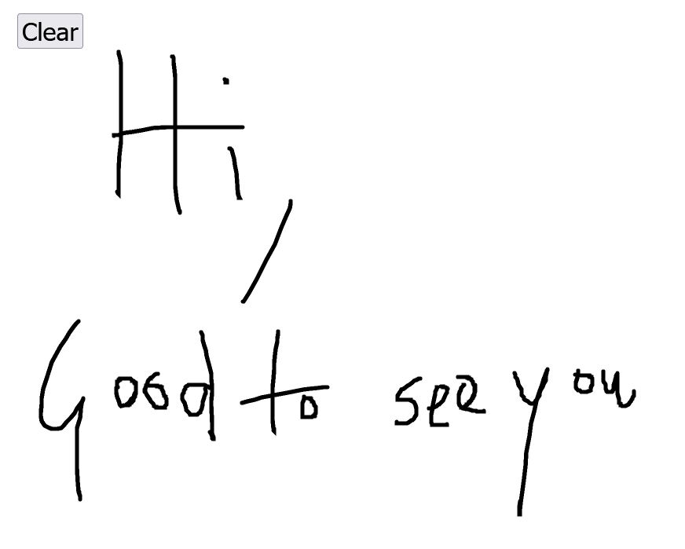

# Sketch Card
  
> A single page website to help the user sketch easily.

## Table of Contents
* [General Info](#general-information)
* [Technologies Used](#technologies-used)
* [Setup](#setup)
* [License](#License)
<!-- * [License](#license) -->

## General Information
- A website to sketch easily.
- Clear Screen button to clear all the doodles drawn until that moment.
<!-- You don't have to answer all the questions - just the ones relevant to your project. -->

## Technologies Used
  
- react - 16.13.1
- drawing-react-canvas - 0.1.0

## Setup
Download the code, type the following code in your commandshell:
`npm start`
Visit `localhost:300` on your preffered browser and watch the website and edit in your own way

## License
This project is licensed under the MIT License - see the LICENSE.md file for details.
